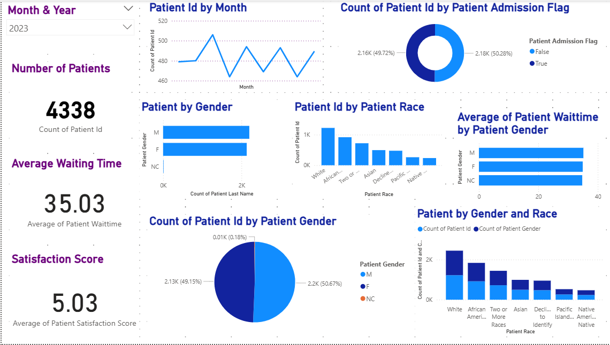
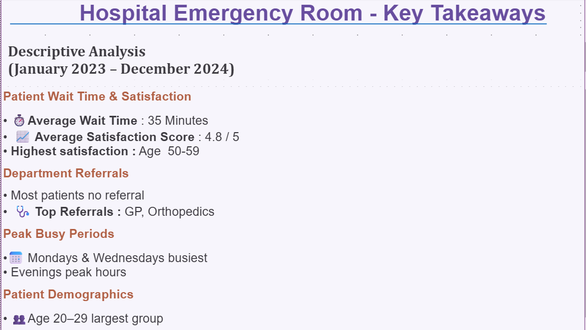

# 🏥 Hospital Emergency Room Dashboard (Power BI)

An interactive data visualization project built using Power BI to analyze hospital emergency room (ER) operations, patient flow, and performance metrics.  
The project focuses on transforming ER data into meaningful insights that support operational planning and decision-making.

---

## 📌 Project Overview

Emergency rooms operate under constant pressure and generate large volumes of data.  
This dashboard was created to explore historical ER data and answer key questions such as:

- When does the ER experience peak patient load?
- How long do patients typically wait?
- Which departments receive the most referrals?
- How do patient demographics impact ER usage and satisfaction?

The dashboard helps identify patterns, bottlenecks, and trends to improve efficiency and patient experience.

---

## 🗂️ Dataset Description

The analysis uses a structured Emergency Room dataset containing patient-level and visit-level information.

### Key Data Elements

| Category | Description |
|--------|------------|
| Patient Details | Age, gender, race, patient identifiers |
| Visit Information | Arrival time, discharge time, wait time, admission status |
| Department Data | Referral department and reason for visit |
| Operational Metrics | Patient counts by hour and day |
| Feedback | Patient satisfaction scores |

The dataset was cleaned and transformed using **Power Query** before visualization.

---

## ⚙️ Tools & Technologies

| Tool | Purpose |
|----|--------|
| Power BI Desktop | Dashboard creation and visualization |
| Power Query | Data cleaning and transformation |
| DAX | Measures and KPIs |
| CSV File | Source dataset |

---

## 📊 Dashboard Views

### 1️⃣ Overall Emergency Room Monthly Overview

Provides a high-level summary of ER performance, including:
- Total patient visits
- Average wait time
- Patient satisfaction score
- Admissions vs non-admissions



---

### 2️⃣ Emergency Room Patient Details Analysis

Focuses on operational insights such as:
- Wait time distribution by department
- Visit trends by day of the week
- Patient flow across different times of day


---

### 3️⃣ Key Takeaways

Summarizes the most important insights derived from the analysis.



---

## 📈 Key Findings & Observations

**(January 2023 – December 2024)**

- **3,613** unique patients analyzed
- Average wait time: **~35 minutes**
- Overall satisfaction score: **4.86 / 5**
- Highest satisfaction: **Age 50–59**
- Lowest satisfaction: **Age 70–79**

### Department Referrals
- Majority of patients required no referral
- Most common referrals:
  - General Practice
  - Orthopedics
  - Physiotherapy
  - Cardiology

### Peak Usage Patterns
- **Busiest days:** Wednesday, Monday, Sunday
- **Busiest hours:** 6 PM – 12 AM

### Admission Trends
Admissions and treated-and-released patients were almost evenly split, indicating sustained ER demand.

---

## 🧠 What This Project Demonstrates

- Real-world data cleaning and transformation
- KPI creation using DAX
- Business-focused dashboard design
- Actionable insight generation from healthcare data

---

## ▶️ How to Explore the Project

- Review dashboard screenshots in the `dashboard_images/` folder  
- Read the insights and findings documented above  
- Use the dataset to recreate or extend the dashboard in Power BI  

**Note:** The Power BI `.pbix` file is not included to keep the repository lightweight and focused on results.

---

## 🔮 Future Enhancements

- Predictive analysis for peak hours and patient volume  
- Real-time data integration  
- Cost and length-of-stay analysis  
- Publishing dashboards via Power BI Service  

---

## 💡 Final Note

This project demonstrates practical Power BI and data analytics skills applied to a real-world healthcare operations use case, with emphasis on clarity, insight generation, and decision support.

---

## 📁 Repository Structure

```text
Hospital-Emergency-Room-Dashboard/
├── dashboard_images/
│   ├── monthly_view.png
│   ├── patient_details.png
│   └── takeaways.png
├── Hospital ER_Data.csv
└── README.md
